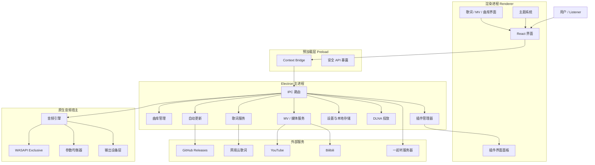

<div align="center">


# ECHO

### 一款可爱、锋利、认真对待声音的 Hi-Fi 桌面音乐播放器

<p>
  <b>本地音乐</b>
  ·
  <b>逐字歌词</b>
  ·
  <b>MV 播放</b>
  ·
  <b>插件系统</b>
  ·
  <b>Bit-perfect 梦想</b>
</p>

<p>
  <a href="https://github.com/Moekotori/ECHO/releases/latest">
    
  </a>
  <a href="https://github.com/Moekotori/ECHO/stargazers">
    
  </a>
  <a href="https://github.com/Moekotori/ECHO/releases">
    
  </a>
  
  
  
</p>

<p>
  <a href="https://github.com/Moekotori/ECHO/releases/latest"><b>下载最新版本</b></a>
  ·
  <a href="#功能特性"><b>功能特性</b></a>
  ·
  <a href="#项目架构"><b>项目架构</b></a>
  ·
  <a href="docs/plugin-development.md"><b>插件开发</b></a>
</p>

</div>

---

## ECHO 是什么？

**ECHO** 是一款现代化桌面音乐播放器。

它不是只把音乐“放出来”的工具，而是一个放在桌面上的小型音乐空间：  
本地曲库、逐字歌词、MV 播放、主题系统、插件扩展、同步听歌，以及认真设计过的原生音频播放链路。

外表干净、柔软、有一点二次元气质。  
内部锋利、稳定、尽可能接近你想要的声音。

> 让音乐不是后台噪声，  
> 而是重新回到屏幕中央。

---

## 功能特性

<table>
  <tr>
    <td width="50%" valign="top">
      <h3>Hi-Fi 音频引擎</h3>
      <p>
        使用独立原生音频宿主进程进行播放，降低主界面与音频链路之间的互相影响。
        支持低延迟播放、音频输出设备切换、参数均衡器，以及 Windows WASAPI Exclusive Mode，
        面向更纯净、更稳定的本地音乐体验。
      </p>
    </td>
    <td width="50%" valign="top">
      <h3>逐字歌词系统</h3>
      <p>
        支持 LRC 歌词、逐行同步、逐字高亮与卡拉 OK 式显示效果。
        可自动获取网易云歌词，也支持手动搜索候选歌词。
        对日文歌曲支持罗马音转换与桌面悬浮歌词。
      </p>
    </td>
  </tr>
  <tr>
    <td width="50%" valign="top">
      <h3>MV 播放模式</h3>
      <p>
        可从 YouTube 或 Bilibili 匹配并播放音乐视频。
        支持将 MV 作为播放背景，让播放器不只是列表和进度条，而像一个小小的舞台。
      </p>
    </td>
    <td width="50%" valign="top">
      <h3>插件系统</h3>
      <p>
        提供沙盒化插件架构。
        插件可以扩展音乐源、歌词源、界面面板、后台逻辑等能力，
        让 ECHO 不被固定功能边界锁死。
      </p>
    </td>
  </tr>
  <tr>
    <td width="50%" valign="top">
      <h3>主题系统</h3>
      <p>
        基于 CSS 变量的主题引擎，支持主题导入、导出与编辑。
        可以做成柔和、暗色、赛博、透明、二次元，或者完全属于你的样子。
      </p>
    </td>
    <td width="50%" valign="top">
      <h3>一起听</h3>
      <p>
        通过可选的 WebSocket 服务实现房间式同步听歌。
        当音乐被同时听见，它就不再只是一个人的声音。
      </p>
    </td>
  </tr>
</table>

---

## 更多能力

- 本地音乐文件夹扫描
- 曲库管理与专辑封面展示
- 播放列表、喜欢歌曲、播放队列
- 播放速度控制与音调保持
- 音频输出设备无缝切换
- 实时参数均衡器与前级增益
- NCM 格式转换
- YouTube / Bilibili / SoundCloud 音频下载
- 网易云歌单导入
- DLNA 投放
- Discord Rich Presence
- 分享卡片导出
- 崩溃报告与应用内日志查看器
- 中文、英文、日文界面

---

## Star 增长趋势

<div align="center">

<a href="https://starchart.cc/Moekotori/ECHO">
  
</a>

</div>

---

## 项目架构



---

## 项目结构

```txt
ECHO/
├─ src/
│  ├─ main/
│  │  ├─ audio/          # 原生音频桥接与音频引擎封装
│  │  ├─ cast/           # DLNA 投放逻辑
│  │  ├─ plugins/        # 插件管理器、沙盒与插件存储
│  │  └─ ...             # IPC、更新、曲库、歌词、媒体服务
│  │
│  ├─ preload/           # 安全的 Context Bridge API
│  │
│  └─ renderer/
│     └─ src/
│        ├─ components/  # 界面组件
│        ├─ locales/     # 国际化文本：中文、英文、日文
│        ├─ styles/      # 全局样式与主题变量
│        └─ App.jsx      # 渲染进程入口
│
├─ server/
│  └─ listen-together/   # 可选的一起听同步服务器
│
├─ scripts/              # 构建、发布、维护脚本
├─ docs/                 # 开发文档
├─ examples/             # 示例插件
└─ logo.png              # 项目 Logo
```

---

## 环境要求

| 依赖 | 版本 |
|---|---|
| Node.js | >= 18 |
| npm | >= 9 |
| Electron | 31.x |

> ECHO 当前主要面向 Windows。  
> 如果需要本地开发原生依赖，例如 `naudiodon`，推荐使用 Node.js 20 LTS。

---

## 开始开发

### 克隆仓库

```bash
git clone https://github.com/Moekotori/ECHO.git
cd ECHO
```

### 安装依赖

```bash
npm install
```

原生模块会通过项目的 postinstall 流程自动安装和构建。

### 启动开发环境

```bash
npm run dev
```

---

## 构建

### Windows 构建

```bash
npm run build:win
```

### Windows 发布构建

```bash
npm run build:win:release
```

发布构建会生成用于 GitHub Releases 与自动更新所需的相关文件。

---

## 测试

```bash
npm run test:unit
```

发布前建议执行：

```bash
npm run verify:release
```

完整发布检查流程见：

```txt
docs/RELEASE_CHECKLIST.md
```

---

## 插件开发

ECHO 支持通过沙盒化插件系统扩展功能。

一个插件通常包含：

```txt
plugin.json
main.js
renderer.js
styles.css
```

插件可以扩展：

- 自定义音乐源
- 自定义歌词源
- 渲染进程界面面板
- 后台逻辑
- 插件配置与存储

完整插件开发文档：

[docs/plugin-development.md](docs/plugin-development.md)

---

## 一起听服务器

可选的一起听服务器用于实现房间式同步播放。

```bash
cd server/listen-together
npm install
PORT=8787 npm start
```

生产环境部署说明见：

```txt
server/listen-together/DEPLOY_FROM_ZERO_ZH.md
```

---

## 贡献者

<div align="center">

<a href="https://github.com/Moekotori/ECHO/graphs/contributors">
  
</a>

<br>

<sub>贡献者头像由 contrib.rocks 自动生成并实时更新。</sub>

</div>

---

## 参与贡献

欢迎提交 Pull Request。

提交前建议：

1. Fork 本仓库
2. 创建新的功能分支
3. 保持现有代码风格
4. 必要时运行测试与发布检查
5. 清楚说明本次修改内容与原因

```bash
npm run test:unit
npm run verify:release
```

---

## 鸣谢

ECHO 基于这些优秀的开源项目构建：

- [Electron](https://www.electronjs.org/)
- [React](https://react.dev/)
- [electron-vite](https://electron-vite.org/)
- [naudiodon](https://github.com/Streampunk/naudiodon)
- [Kuroshiro](https://kuroshiro.org/)
- [music-metadata](https://github.com/borewit/music-metadata)
- [yt-dlp](https://github.com/yt-dlp/yt-dlp)
- [FFmpeg](https://ffmpeg.org/)
- [lucide-react](https://lucide.dev/)

---

<div align="center">

### ECHO

让播放器不只是播放器。  
让音乐重新变成一件值得凝视的事。

</div>
````
