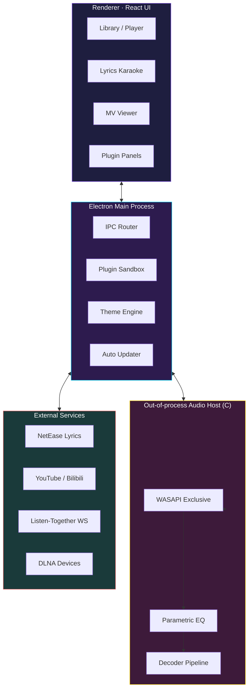

<div align="center">


<br />


<br />

<a href="https://github.com/Moekotori/ECHO">
  
</a>

<br /><br />

<!-- Hero Badges -->

<p>
  <a href="https://github.com/Moekotori/ECHO/releases">
    
  </a>
  <a href="https://github.com/Moekotori/ECHO/stargazers">
    
  </a>
  <a href="https://github.com/Moekotori/ECHO/releases">
    
  </a>
  <a href="https://github.com/Moekotori/ECHO/issues">
    
  </a>
  <a href="LICENSE">
    
  </a>
</p>

<p>
  
  
  
</p>

<br />

<!-- Quick Nav -->

<p>
  <a href="#-项目简介--overview"><b>简介</b></a> ·
  <a href="#-核心特性--features"><b>特性</b></a> ·
  <a href="#-技术栈--tech-stack"><b>技术栈</b></a> ·
  <a href="#-架构--architecture"><b>架构</b></a> ·
  <a href="#-安装--installation"><b>安装</b></a> ·
  <a href="#-插件开发--plugin-development"><b>插件</b></a> ·
  <a href="#%EF%B8%8F-路线图--roadmap"><b>路线图</b></a> ·
  <a href="#-faq--常见问题"><b>FAQ</b></a>
</p>


</div>

##  项目简介 · Overview

如果你想clone代码的话 请移步moe/carnary分支,主分支为最稳定的版本

> *让每一段声波都纯净如初,每一次聆听都不再孤单*

**ECHO** 是一款专为发烧友与音乐爱好者打造的跨平台桌面音乐播放器它不只是一个播放器,更是一座连接你与音乐宇宙的位完美之桥

<table>
<tr>
<td>

 **硬件级音质**
WASAPI 独占 + C 原生音频宿主,告别系统混音重采样

</td>
<td>

 **沉浸式歌词**
逐字卡拉 OK + 日文罗马音 + 网易云自动抓取

</td>
<td>

 **音画一体**
YouTube / Bilibili MV 智能匹配,音乐与画面同步

</td>
</tr>
<tr>
<td>

 **社交共听**
WebSocket 房间 + DLNA 投屏,与好友隔空同步

</td>
<td>

 **可扩展**
沙箱化插件系统,音源 / 歌词 / UI 任你魔改

</td>
<td>

 **可自定义**
CSS 变量主题编辑器,一键切换视觉风格

</td>
</tr>
</table>

<div align="center">

</div>

##  核心特性 · Features

<details open>
<summary><b> HiFi 音频引擎</b> · <i>Out-of-process Native Audio Host</i></summary>

<br />

| 能力                   | 说明                                |
| :--------------------- | :---------------------------------- |
|  **WASAPI Exclusive** | Windows 位完美直通,绕过系统混音器   |
|  **独立音频进程**     | C 语言原生实现,主进程崩了音乐都不停 |
|  **参数化均衡器**     | 多段 EQ 实时调音,内置预设可保存     |
|  **高保真支持**       | 24bit / 192kHz 无损采样             |
|  **NCM 转换**         | 网易云加密格式无损转码              |

</details>

<details open>
<summary><b> 同步歌词系统</b> · <i>Karaoke-grade Lyrics</i></summary>

<br />

-  **LRC 标准 + 逐字卡拉 OK 模式** —— 一字一闪烁,KTV 既视感
-  **网易云歌词 API** —— 自动匹配抓取,翻译 / 音译可选
- 🇯🇵 **Kuroshiro 日文转换** —— 汉字    Romaji,一键搞定
-  **四语界面** —— English · 简体中文 · 繁體中文 · 日本語

</details>

<details>
<summary><b> 音乐视频 (MV)</b> · <i>Auto-match YouTube & Bilibili</i></summary>

<br />

-  智能识别曲目 → 自动从 YouTube / Bilibili 拉取 MV
-  多清晰度可选(360p / 720p / 1080p / 4K)
-  音画播放进度同步联动

</details>

<details>
<summary><b> 共听房间 · Listen Together</b></summary>

<br />

-  自建 **WebSocket** 共听服务器(`server/listen-together`)
-  **DLNA / UPnP** 投屏到智能音箱电视
-  房主控播,房客实时同步,聊天与点歌一体

</details>

<details>
<summary><b> 媒体下载</b> · <i>YouTube · Bilibili · SoundCloud</i></summary>

<br />

-  基于 `yt-dlp` + `FFmpeg`,支持几乎所有主流平台
-  自动写入 ID3 / FLAC 元数据 + 高清封面
-  批量下载,断点续传

</details>

<details>
<summary><b> 插件系统</b> · <i>Sandboxed Extensibility</i></summary>

<br />

| 插件类型          | 用途                                        |
| :---------------- | :------------------------------------------ |
|  Music Source    | 接入第三方曲库(QQ 音乐 / Spotify / 自建源…) |
|  Lyrics Provider | 自定义歌词来源(LRCLIB / 自建库…)            |
|  UI Panel        | 注入侧边栏 / 浮窗,扩展界面功能              |

详见 [`plugin development/`](./plugin%20development) 目录

</details>

<details>
<summary><b> 主题与体验</b> · <i>Beautiful by default, hackable forever</i></summary>

<br />

-  **CSS 变量主题编辑器** —— 应用内可视化调色,导入导出 JSON
-  **Discord Rich Presence** —— 让你的好友看见你正在听什么
-  **electron-updater** —— GitHub Releases OTA 自动更新
-  **全局快捷键** + **托盘控制** + **桌面歌词**(Roadmap)

</details>

<div align="center">

</div>

##  技术栈 · Tech Stack

<div align="center">

<a href="https://skillicons.dev">
  
</a>

<br /><br />

|      模块       | 技术选型                               |    占比     |
| :-------------: | :------------------------------------- | :---------: |
|  **桌面框架**  | Electron 31.x · electron-vite          |      —      |
|   **前端 UI**  | React 18 · lucide-react                |  28.6% JS   |
|  **原生音频**  | naudiodon · WASAPI Native Host         | **61.6% C** |
|  **媒体处理**  | FFmpeg · yt-dlp · music-metadata       |      —      |
| 🇯🇵 **文本处理** | Kuroshiro (日文罗马音转换)             |      —      |
|  **网络通信**  | WebSocket · DLNA / UPnP                |      —      |
|  **样式系统**  | CSS Variables · 主题引擎               |  5.5% CSS   |
|  **自动更新**  | electron-updater (GitHub Releases OTA) |      —      |

</div>

<div align="center">

</div>

##  架构 · Architecture



>  **设计哲学**:UI 与音频引擎分离,渲染卡顿绝不影响播放;插件运行在沙箱,安全与扩展性兼得

<div align="center">

</div>

##  安装 · Installation

###  方式一:下载安装包(推荐)

<div align="center">

[](https://github.com/Moekotori/ECHO/releases/latest)

</div>

###  方式二:从源码构建

```bash
# 克隆仓库
git clone https://github.com/Moekotori/ECHO.git && cd ECHO

# 安装依赖
npm install

# 开发模式
npm run dev

# 打包构建
npm run build:win    # Windows
```

>  首次启动会自动下载 FFmpeg / yt-dlp 等运行时,请保持网络畅通

<div align="center">

</div>

##  项目结构 · Structure

```
ECHO/
├──  src/                      # React 前端源码
├──   electron-app/            # Electron 主进程
├──  _HOTFIX_192K/             # 高采样率原生音频补丁
├──  server/listen-together/   # 共听 WebSocket 服务
├──  plugin development/       # 插件开发文档与 SDK
├──  examples/                 # 示例插件
├──  scripts/                  # 构建与工具脚本
├──  docs/                     # 项目文档
├──  website/                  # 官方站点
├──  artifacts/                # CI 构建产物
├──  test/unit/                # 单元测试
├──  .cursor/                  # Cursor IDE 配置
├──  electron.vite.config.mjs
└──  package.json
```

<div align="center">

</div>

##  插件开发 · Plugin Development

ECHO 提供完整的沙箱化插件 API,你可以扩展三大维度:

<table>
<tr>
<td align="center" width="33%">

###

**Music Source**
接入自定义曲库
</td>
<td align="center" width="33%">

###

**Lyrics Provider**
自定义歌词来源
</td>
<td align="center" width="33%">

###

**UI Panel**
注入界面组件
</td>
</tr>
</table>

```js
// 一个最小的歌词插件示例
export default {
  name: 'my-lyrics-source',
  type: 'lyrics',
  async fetch(track) {
    const res = await fetch(`https://api.example.com/lyrics?q=${track.title}`)
    return await res.text()
  }
}
```

 完整文档:[`plugin development/`](./plugin%20development)
 示例集合:[`examples/`](./examples)

<div align="center">

</div>

##  路线图 · Roadmap

- [x]  WASAPI 独占输出 + 原生音频宿主
- [x]  逐字卡拉 OK 歌词 + 日文罗马音
- [x]  YouTube / Bilibili MV 自动匹配
- [x]  共听房间 + DLNA 投屏
- [x]  沙箱化插件系统
- [x]  CSS 变量主题编辑器
- [ ]  **桌面歌词浮窗**(透明置顶)
- [ ]  **跨设备播放接力**(Handoff)
- [ ]  **AI 智能推荐 / 心情电台**
- [ ]  **本地音色克隆 & AI 翻唱**
- [ ]  **更多语言**(한국어 / Français / Español)

>  想要某个功能?来 [Issues](https://github.com/Moekotori/ECHO/issues) 提建议!

<div align="center">

</div>

##  FAQ · 常见问题

<details>
<summary><b>Q: 为什么需要 WASAPI 独占模式?和共享模式有什么区别?</b></summary>

<br />

共享模式下,音频会经过 Windows 系统混音器,可能被重采样至默认格式(通常 48kHz / 16bit),导致原始 44.1kHz / 24bit 信号失真
**WASAPI 独占模式**直接占用声卡,绕过混音器,实现真正的比特完美输出

</details>

<details>
<summary><b>Q: 共听房间需要公网服务器吗?</b></summary>

<br />

不一定`server/listen-together` 可以本地局域网部署,也可托管到公网任意能跑 Node.js 的环境都行

</details>

<details>
<summary><b>Q: 插件会不会有安全风险?</b></summary>

<br />

ECHO 插件运行在 **沙箱环境** 中,有权限隔离机制所有网络请求文件读写都需声明权限,详见插件开发文档

</details>


<details>
<summary><b>Q: 网易云 / Bilibili 接口失效了怎么办?</b></summary>

<br />

ECHO 团队会尽快跟进修复,你也可以通过 **插件系统** 自定义替代源,或在 [Issues](https://github.com/Moekotori/ECHO/issues) 反馈

</details>

<div align="center">

</div>

##  贡献 · Contributing

欢迎所有形式的贡献!Bug 反馈 · 功能建议 · 文档改进 · 代码 PR 都热烈欢迎

```bash
# Fork → Branch → Commit → Push → PR
git checkout -b feature/AmazingFeature
git commit -m ' feat: add some amazing feature'
git push origin feature/AmazingFeature
```

<div align="center">

[](https://github.com/Moekotori/ECHO/graphs/contributors)

</div>

<div align="center">

</div>

##  数据 · Stats

<div align="center">


[](https://star-history.com/#Moekotori/ECHO&Date)

</div>

<div align="center">

</div>

##  开源协议 · License

本项目基于 **MIT License** 开源 —— 自由使用,自由魔改,记得保留版权声明
详见 [LICENSE](LICENSE) 文件

##  致谢 · Acknowledgements

衷心感谢以下开源项目让 ECHO 成为可能:

<div align="center">

[Electron](https://electronjs.org) · [React](https://react.dev) · [electron-vite](https://electron-vite.org) · [naudiodon](https://github.com/streamich/naudiodon) · [Kuroshiro](https://github.com/hexenq/kuroshiro) · [music-metadata](https://github.com/Borewit/music-metadata) · [yt-dlp](https://github.com/yt-dlp/yt-dlp) · [FFmpeg](https://ffmpeg.org) · [lucide-react](https://lucide.dev)

以及网易云音乐BilibiliYouTube 的开放生态,所有星标 / 反馈 / PR 的朋友们

</div>

<br />

<div align="center">


###  如果你喜欢 ECHO,请给个 Star!

**Made with  and  by [@Moekotori](https://github.com/Moekotori)**

*Listen Bit-Perfect · Listen Together · Listen as ECHO*

<a href="https://github.com/Moekotori">
  
</a>

</div>
